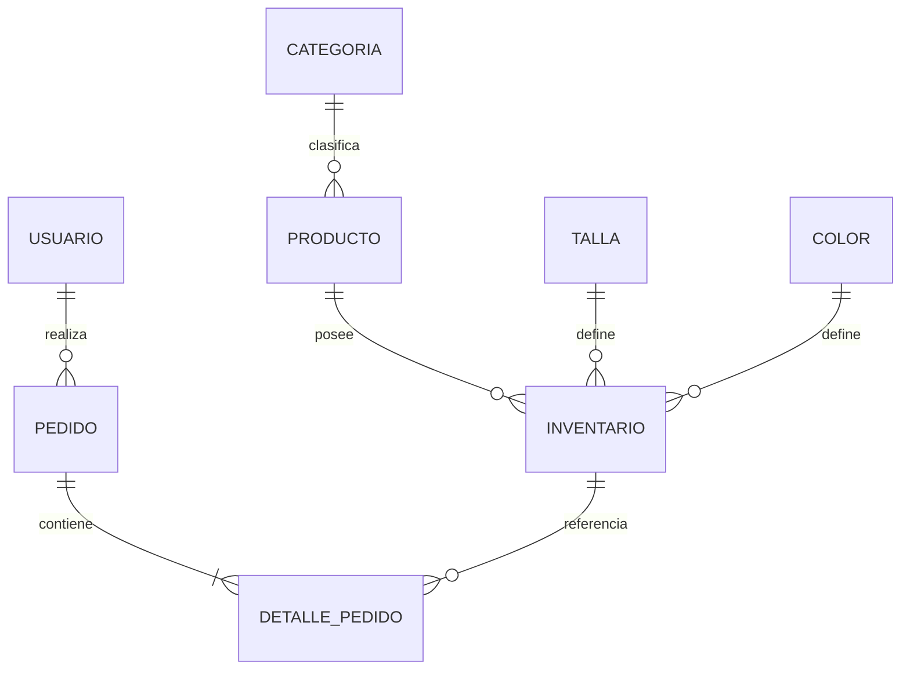

# Modelo de datos RopaExpress

## Decisión de diseño clave

`Inventario` representa la variante exacta de un producto mediante `producto_id + talla_id + color_id`. Esto permite mantener el producto como entidad de catálogo y controlar el stock sin duplicar el producto por cada combinación.
